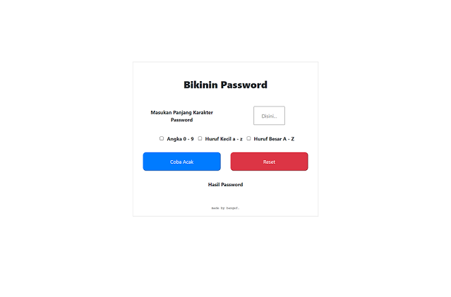
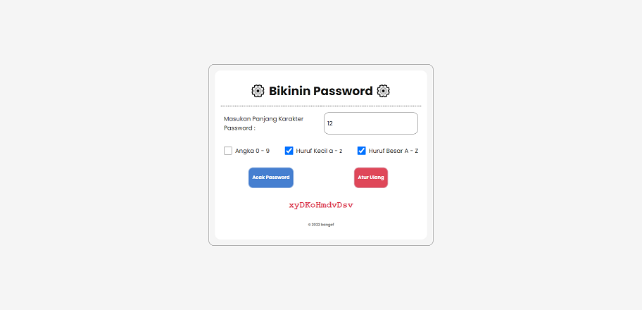
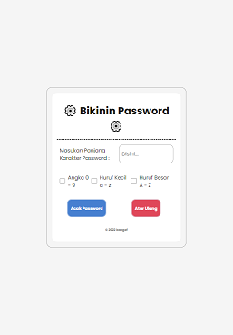
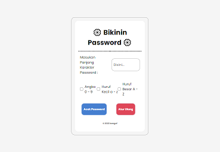
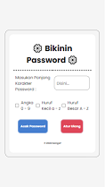

## _PROJECT ISENG : APLIKASI BIKIN PASSWORD_

### Deskripsi :
* Membangun ulang UI lama ke yg baru
* Menerapkan Responsive Web Desain
* Refactoring Javascript
* Menggunakan lib jquery

### Sebelum :

### Hasil
#### Screenshoot RWD *DESKTOP* dan *Menjalankan Program*

#### Screenshoot RWD *TAB PORTAIT*

#### Screenshoot RWD *TAB LANDSCAPE*

#### Screenshoot RWD *MOBILE*
